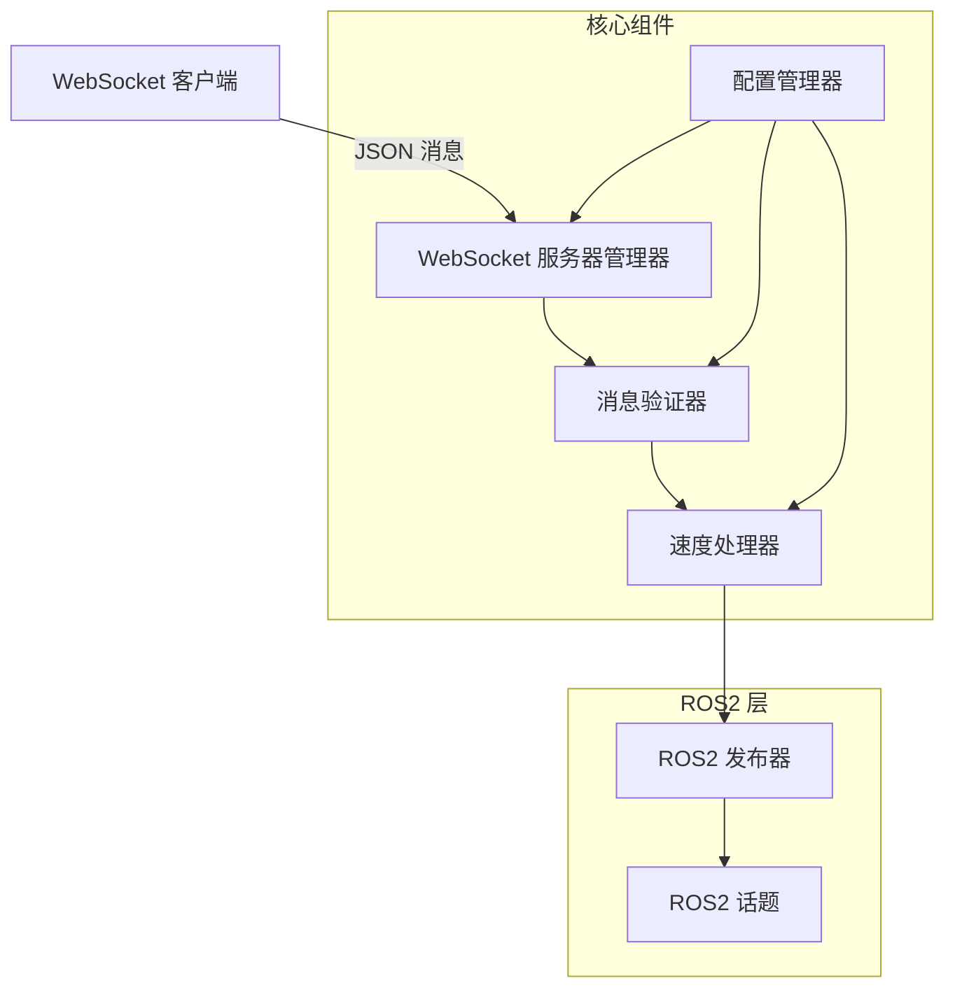

# Remote Controller 开发文档

## 目录

- [项目架构](#项目架构)
- [核心组件](#核心组件)
- [开发环境设置](#开发环境设置)
- [构建系统](#构建系统)
- [代码结构](#代码结构)
- [扩展开发](#扩展开发)
- [测试策略](#测试策略)
- [性能优化](#性能优化)
- [故障排除](#故障排除)

## 项目架构

### 整体架构图



### 组件职责

| 组件 | 职责 | 输入 | 输出 |
|------|------|------|------|
| `RemoteController` | 主节点，协调各组件 | ROS2 启动参数 | 系统状态 |
| `WebSocketServerManager` | WebSocket 服务器管理 | JSON 字符串 | JSON 响应 |
| `MessageValidator` | 输入验证 | JSON 对象 | 验证结果 |
| `VelocityProcessor` | 消息处理逻辑 | 验证后的数据 | ROS2 消息 |
| `ConfigManager` | 配置管理 | 文件/环境变量 | 配置对象 |
| `ResponseBuilder` | 响应构建 | 处理结果 | 标准 JSON 响应 |

## 核心组件

### 1. RemoteController (主节点)

**文件**: `src/remote_controller.cpp`, `include/remote_controller/`

```cpp
class RemoteController : public rclcpp::Node
{
private:
    // 核心组件实例
    rclcpp::Publisher<geometry_msgs::msg::Twist>::SharedPtr publisher_;
    std::shared_ptr<remote_controller::ConfigManager> config_manager_;
    std::shared_ptr<remote_controller::MessageValidator> validator_;
    std::unique_ptr<remote_controller::VelocityProcessor> velocity_processor_;
    std::unique_ptr<remote_controller::WebSocketServerManager> websocket_server_;
    
    // 初始化方法
    void initializeComponents();
    void setupConfiguration();
    void setupRosPublisher();
    void setupVelocityProcessor();
    void setupWebSocketServer();
    
    // 消息处理回调
    nlohmann::json handleVelocityMessage(const std::string& payload);
};
```

**关键特性**：
- ROS2 节点生命周期管理
- 组件初始化和协调
- 异常处理和优雅关闭

### 2. ConfigManager (配置管理器)

**文件**: `src/config.cpp`, `include/remote_controller/config.hpp`

```cpp
class ConfigManager
{
public:
    bool loadConfig(const std::string& config_file_path = "");
    const Config& getConfig() const;
    
private:
    Config config_;
    void loadDefaults();
    void overrideFromEnvironment();
    bool overrideFromFile(const std::string& file_path);
};
```

**配置层次结构**：

```
环境变量 (最高优先级)
    ↓
JSON 配置文件
    ↓
默认值 (最低优先级)
```

**支持的配置项**：

```cpp
struct Config {
    WebSocketConfig websocket;  // 端口、主机、最大连接数
    ROSConfig ros;             // 话题队列大小、Hub ID
    LoggingConfig logging;     // 日志级别、WebSocket 日志
};
```

### 3. WebSocketServerManager (WebSocket 服务器)

**文件**: `src/websocket_server.cpp`, `include/remote_controller/websocket_server.hpp`

```cpp
class WebSocketServerManager
{
public:
    bool start();
    void stop();
    void setMessageHandler(MessageHandlerFunction handler);
    
private:
    websocketpp::server<websocketpp::config::asio> server_;
    std::thread server_thread_;
    std::atomic<bool> running_;
    MessageHandlerFunction message_handler_;
};
```

**关键特性**：
- 异步消息处理
- 连接状态管理
- 错误处理和恢复
- 线程安全设计

### 4. MessageValidator (消息验证器)

**文件**: `src/validator.cpp`, `include/remote_controller/validator.hpp`

```cpp
struct VelocityLimits {
    double linear_x_min = -5.0;
    double linear_x_max = 5.0;
    double angular_z_min = -3.14;
    double angular_z_max = 3.14;
};

class MessageValidator
{
public:
    ValidationResult validateVelocityCommand(const nlohmann::json& json_msg);
    
private:
    VelocityLimits limits_;
    bool validateField(const nlohmann::json& json, const std::string& field);
    bool validateRange(double value, double min, double max);
};
```

**验证规则**：
1. 必需字段存在性检查
2. 数据类型验证
3. 数值范围验证
4. NaN/Infinity 检查

### 5. VelocityProcessor (速度处理器)

**文件**: `src/velocity_processor.cpp`, `include/remote_controller/velocity_processor.hpp`

```cpp
class VelocityProcessor
{
public:
    ProcessingResult processVelocityCommand(const std::string& payload);
    
private:
    rclcpp::Publisher<geometry_msgs::msg::Twist>::SharedPtr publisher_;
    std::shared_ptr<MessageValidator> validator_;
    std::shared_ptr<ConfigManager> config_manager_;
    
    geometry_msgs::msg::Twist createTwistMessage(double linear_x, double angular_z);
    nlohmann::json createSuccessResponse(const geometry_msgs::msg::Twist& twist);
};
```

**处理流程**：

```
JSON 字符串输入
    ↓
JSON 解析
    ↓
消息验证
    ↓
Twist 消息创建
    ↓
ROS2 话题发布
    ↓
响应生成
```

### 6. ResponseBuilder (响应构建器)

**文件**: `src/response.cpp`, `include/remote_controller/response.hpp`

```cpp
class ResponseBuilder
{
public:
    static nlohmann::json createSuccessResponse(const nlohmann::json& data);
    static nlohmann::json createErrorResponse(
        const std::string& code,
        const std::string& message,
        int status_code,
        const std::string& field = "",
        const std::string& suggestion = ""
    );
    
private:
    static nlohmann::json createMetadata();
    static std::string generateRequestId();
};
```

**响应格式标准化**：
- 统一的 success/error 结构
- 标准化的元数据
- 唯一请求 ID 生成
- 处理时间统计

## 开发环境设置

### 1. 环境要求

```bash
# Ubuntu 版本
lsb_release -a  # 应显示 20.04 或更高

# ROS2 版本
echo $ROS_DISTRO  # 应显示 humble 或更高

# 编译器版本
g++ --version  # 应支持 C++14

# CMake 版本
cmake --version  # 应为 3.8 或更高
```

### 2. 开发依赖安装

```bash
# 基础开发工具
sudo apt install build-essential cmake git

# ROS2 开发工具
sudo apt install ros-$ROS_DISTRO-ament-cmake
sudo apt install ros-$ROS_DISTRO-ament-lint-auto
sudo apt install ros-$ROS_DISTRO-ament-lint-common

# 项目特定依赖
sudo apt install libwebsocketpp-dev
sudo apt install nlohmann-json3-dev
sudo apt install libgtest-dev

# 调试和分析工具
sudo apt install gdb valgrind
sudo apt install clang-format clang-tidy
```

### 3. IDE 配置

#### VS Code 配置

创建 `.vscode/c_cpp_properties.json`：

```json
{
    "configurations": [
        {
            "name": "ROS2",
            "includePath": [
                "${workspaceFolder}/**",
                "/opt/ros/humble/include/**",
                "/usr/include/**"
            ],
            "defines": [],
            "compilerPath": "/usr/bin/gcc",
            "cStandard": "c17",
            "cppStandard": "c++14",
            "intelliSenseMode": "linux-gcc-x64"
        }
    ],
    "version": 4
}
```

创建 `.vscode/tasks.json`：

```json
{
    "version": "2.0.0",
    "tasks": [
        {
            "label": "build",
            "type": "shell",
            "command": "colcon",
            "args": ["build", "--packages-select", "remote_controller"],
            "group": "build",
            "presentation": {
                "echo": true,
                "reveal": "always",
                "focus": false,
                "panel": "shared"
            },
            "problemMatcher": "$gcc"
        }
    ]
}
```

## 构建系统

### CMakeLists.txt 分析

```cmake
cmake_minimum_required(VERSION 3.8)
project(remote_controller)

# 编译选项
if(CMAKE_COMPILER_IS_GNUCXX OR CMAKE_CXX_COMPILER_ID MATCHES "Clang")
  add_compile_options(-Wall -Wextra -Wpedantic)
endif()

# 依赖查找
find_package(ament_cmake REQUIRED)
find_package(rclcpp REQUIRED)
find_package(geometry_msgs REQUIRED)
find_package(nlohmann_json REQUIRED)
find_package(websocketpp REQUIRED)

# 可执行文件构建
add_executable(remote_controller_node
  src/remote_controller.cpp
  src/config.cpp
  src/response.cpp
  src/validator.cpp
  src/velocity_processor.cpp
  src/websocket_server.cpp
)

# 依赖链接
ament_target_dependencies(remote_controller_node
  rclcpp
  geometry_msgs
)

target_link_libraries(remote_controller_node
  nlohmann_json::nlohmann_json
  websocketpp::websocketpp
)
```

### 构建脚本

创建 `scripts/build.sh`：

```bash
#!/bin/bash

set -e

# 颜色定义
RED='\033[0;31m'
GREEN='\033[0;32m'
YELLOW='\033[1;33m'
NC='\033[0m' # No Color

echo -e "${YELLOW}构建 Remote Controller...${NC}"

# 检查 ROS2 环境
if [[ -z "$ROS_DISTRO" ]]; then
    echo -e "${RED}错误: ROS2 环境未设置${NC}"
    echo "请运行: source /opt/ros/humble/setup.bash"
    exit 1
fi

# 创建构建目录
mkdir -p build

# 清理之前的构建（可选）
if [[ "$1" == "clean" ]]; then
    echo -e "${YELLOW}清理构建文件...${NC}"
    rm -rf build install log
fi

# 构建项目
echo -e "${YELLOW}开始构建...${NC}"
colcon build --packages-select remote_controller \
             --cmake-args -DCMAKE_BUILD_TYPE=Debug \
             --event-handlers console_direct+

if [[ $? -eq 0 ]]; then
    echo -e "${GREEN}构建成功!${NC}"
    echo -e "${YELLOW}设置环境: source install/setup.bash${NC}"
else
    echo -e "${RED}构建失败!${NC}"
    exit 1
fi
```

## 代码结构

### 目录结构详解

```
remote_controller/
├── include/remote_controller/     # 头文件目录
│   ├── config.hpp                # 配置管理器
│   ├── response.hpp              # 响应构建器
│   ├── validator.hpp             # 消息验证器
│   ├── velocity_processor.hpp    # 速度处理器
│   └── websocket_server.hpp      # WebSocket 服务器
├── src/                          # 源文件目录
│   ├── remote_controller.cpp     # 主节点实现
│   ├── config.cpp               # 配置管理实现
│   ├── response.cpp             # 响应构建实现
│   ├── validator.cpp            # 验证器实现
│   ├── velocity_processor.cpp   # 处理器实现
│   └── websocket_server.cpp     # 服务器实现
├── config/                       # 配置文件目录
│   ├── remote_controller_config.json  # 默认配置
│   ├── development_config.json        # 开发配置
│   └── production_config.json         # 生产配置
├── test/                         # 测试目录
│   ├── test_config.cpp          # 单元测试
│   ├── test.py                  # Python 客户端测试
│   ├── test.html                # HTML 测试界面
│   └── test_responses.py        # 响应格式测试
├── launch/                       # Launch 文件目录
│   └── remote_controller.launch.py
├── CMakeLists.txt               # 构建配置
├── package.xml                  # 包配置
└── README.md                    # 使用文档
```

### 编码规范

#### C++ 编码风格

```cpp
// 类名：PascalCase
class MessageValidator {
public:
    // 公有方法：camelCase
    ValidationResult validateMessage(const nlohmann::json& json);
    
private:
    // 私有成员：snake_case_with_trailing_underscore_
    VelocityLimits velocity_limits_;
    bool is_initialized_;
    
    // 私有方法：camelCase
    bool checkFieldExists(const nlohmann::json& json, const std::string& field);
};

// 命名空间：snake_case
namespace remote_controller {
    // 结构体：PascalCase
    struct VelocityLimits {
        double linear_x_min;  // 成员变量：snake_case
        double linear_x_max;
    };
    
    // 枚举：PascalCase，值：UPPER_CASE
    enum class ValidationStatus {
        SUCCESS,
        MISSING_FIELD,
        INVALID_TYPE,
        OUT_OF_RANGE
    };
}

// 常量：UPPER_CASE
const double MAX_LINEAR_VELOCITY = 5.0;
const std::string DEFAULT_CONFIG_FILE = "config/remote_controller_config.json";
```

#### 注释规范

```cpp
/**
 * @brief WebSocket 服务器管理器
 * 
 * 管理 WebSocket 服务器的生命周期，处理客户端连接和消息路由。
 * 支持异步消息处理和优雅关闭。
 */
class WebSocketServerManager {
public:
    /**
     * @brief 启动 WebSocket 服务器
     * @return true 如果启动成功，false 否则
     * @throws std::runtime_error 如果端口被占用
     */
    bool start();
    
    /**
     * @brief 设置消息处理器
     * @param handler 消息处理函数，接收字符串返回 JSON 响应
     */
    void setMessageHandler(MessageHandlerFunction handler);

private:
    websocketpp::server<websocketpp::config::asio> server_;  ///< WebSocket 服务器实例
    std::thread server_thread_;                               ///< 服务器运行线程
    std::atomic<bool> running_;                              ///< 运行状态标志
};
```

### 错误处理模式

#### 1. 异常处理

```cpp
// 构造函数中的异常处理
RemoteController::RemoteController() : Node("remote_controller") {
    try {
        initializeComponents();
        setupConfiguration();
        setupRosPublisher();
        setupWebSocketServer();
    } catch (const std::exception& e) {
        RCLCPP_ERROR(this->get_logger(), "初始化失败: %s", e.what());
        throw;
    }
}

// 配置加载的异常处理
bool ConfigManager::loadConfig(const std::string& config_file_path) {
    try {
        loadDefaults();
        overrideFromEnvironment();
        
        if (!config_file_path.empty()) {
            if (!overrideFromFile(config_file_path)) {
                RCLCPP_WARN(rclcpp::get_logger("config"), "配置文件加载失败，使用默认配置");
            }
        }
        return true;
    } catch (const std::exception& e) {
        RCLCPP_ERROR(rclcpp::get_logger("config"), "配置加载异常: %s", e.what());
        return false;
    }
}
```

#### 2. 返回值错误码

```cpp
enum class ProcessingStatus {
    SUCCESS,
    JSON_PARSE_ERROR,
    VALIDATION_ERROR,
    ROS_PUBLISH_ERROR,
    INTERNAL_ERROR
};

struct ProcessingResult {
    ProcessingStatus status;
    nlohmann::json response;
    std::string error_message;
};

ProcessingResult VelocityProcessor::processVelocityCommand(const std::string& payload) {
    ProcessingResult result;
    
    try {
        // JSON 解析
        nlohmann::json json_msg = nlohmann::json::parse(payload);
        
        // 消息验证
        auto validation_result = validator_->validateVelocityCommand(json_msg);
        if (!validation_result.is_valid) {
            result.status = ProcessingStatus::VALIDATION_ERROR;
            result.response = ResponseBuilder::createErrorResponse(
                validation_result.error_code,
                validation_result.error_message,
                400
            );
            return result;
        }
        
        // ROS 消息发布
        auto twist_msg = createTwistMessage(
            json_msg["linear_x"].get<double>(),
            json_msg["angular_z"].get<double>()
        );
        
        publisher_->publish(twist_msg);
        
        result.status = ProcessingStatus::SUCCESS;
        result.response = createSuccessResponse(twist_msg);
        
    } catch (const nlohmann::json::parse_error& e) {
        result.status = ProcessingStatus::JSON_PARSE_ERROR;
        result.response = ResponseBuilder::createErrorResponse(
            "INVALID_JSON_FORMAT",
            "JSON 解析失败: " + std::string(e.what()),
            400
        );
    } catch (const std::exception& e) {
        result.status = ProcessingStatus::INTERNAL_ERROR;
        result.response = ResponseBuilder::createErrorResponse(
            "INTERNAL_PROCESSING_ERROR",
            "内部处理错误: " + std::string(e.what()),
            500
        );
    }
    
    return result;
}
```

## 扩展开发

### 1. 添加新的验证规则

```cpp
// 在 validator.hpp 中添加新的验证方法
class MessageValidator {
public:
    // 现有验证方法...
    
    // 新增：验证加速度限制
    bool validateAcceleration(const nlohmann::json& json_msg);
    
    // 新增：验证时间戳
    bool validateTimestamp(const nlohmann::json& json_msg);

private:
    struct AccelerationLimits {
        double max_linear_acceleration = 2.0;   // m/s²
        double max_angular_acceleration = 1.0;  // rad/s²
    };
    
    AccelerationLimits accel_limits_;
};

// 在 validator.cpp 中实现
bool MessageValidator::validateAcceleration(const nlohmann::json& json_msg) {
    if (json_msg.contains("acceleration")) {
        auto accel = json_msg["acceleration"];
        
        if (accel.contains("linear") && 
            std::abs(accel["linear"].get<double>()) > accel_limits_.max_linear_acceleration) {
            return false;
        }
        
        if (accel.contains("angular") && 
            std::abs(accel["angular"].get<double>()) > accel_limits_.max_angular_acceleration) {
            return false;
        }
    }
    return true;
}
```

### 2. 添加新的消息类型支持

```cpp
// 新增机械臂控制支持
namespace remote_controller {
    
struct JointCommand {
    std::vector<double> positions;
    std::vector<double> velocities;
    std::vector<double> efforts;
};

class JointCommandProcessor {
public:
    JointCommandProcessor(
        rclcpp::Publisher<sensor_msgs::msg::JointState>::SharedPtr publisher,
        std::shared_ptr<ConfigManager> config_manager
    );
    
    ProcessingResult processJointCommand(const nlohmann::json& json_msg);
    
private:
    rclcpp::Publisher<sensor_msgs::msg::JointState>::SharedPtr joint_publisher_;
    std::shared_ptr<ConfigManager> config_manager_;
    
    sensor_msgs::msg::JointState createJointStateMessage(const JointCommand& cmd);
    bool validateJointCommand(const nlohmann::json& json_msg);
};

} // namespace remote_controller
```

### 3. 添加插件系统

```cpp
// 插件接口定义
class MessageProcessor {
public:
    virtual ~MessageProcessor() = default;
    virtual ProcessingResult processMessage(const nlohmann::json& json_msg) = 0;
    virtual std::string getMessageType() const = 0;
    virtual bool validateMessage(const nlohmann::json& json_msg) = 0;
};

// 插件管理器
class PluginManager {
public:
    void registerProcessor(const std::string& type, std::unique_ptr<MessageProcessor> processor);
    ProcessingResult processMessage(const std::string& type, const nlohmann::json& json_msg);
    std::vector<std::string> getSupportedTypes() const;
    
private:
    std::unordered_map<std::string, std::unique_ptr<MessageProcessor>> processors_;
};

// 在主节点中使用
class RemoteController : public rclcpp::Node {
private:
    std::unique_ptr<PluginManager> plugin_manager_;
    
    void setupPlugins() {
        plugin_manager_ = std::make_unique<PluginManager>();
        
        // 注册速度处理器
        plugin_manager_->registerProcessor(
            "velocity",
            std::make_unique<VelocityProcessor>(publisher_, validator_, config_manager_, get_logger())
        );
        
        // 注册关节控制处理器
        plugin_manager_->registerProcessor(
            "joint_control",
            std::make_unique<JointCommandProcessor>(joint_publisher_, config_manager_)
        );
    }
};
```

### 4. 添加状态监控

```cpp
// 系统状态监控器
class SystemMonitor {
public:
    struct SystemStatus {
        std::chrono::system_clock::time_point last_message_time;
        size_t total_messages_processed;
        size_t error_count;
        double average_processing_time_ms;
        bool websocket_server_running;
        size_t active_connections;
    };
    
    void recordMessageProcessed(double processing_time_ms);
    void recordError();
    void updateConnectionCount(size_t count);
    SystemStatus getStatus() const;
    nlohmann::json getStatusJson() const;
    
private:
    mutable std::mutex status_mutex_;
    SystemStatus status_;
    std::deque<double> processing_times_;
    static constexpr size_t MAX_PROCESSING_TIME_SAMPLES = 100;
};

// 在 WebSocket 服务器中添加状态端点
void WebSocketServerManager::setupStatusEndpoint() {
    server_.set_http_handler([this](websocketpp::connection_hdl hdl) {
        auto con = server_.get_con_from_hdl(hdl);
        
        if (con->get_resource() == "/status") {
            auto status = system_monitor_->getStatusJson();
            con->set_body(status.dump());
            con->set_status(websocketpp::http::status_code::ok);
        }
    });
}
```

## 测试策略

### 1. 单元测试

```cpp
// test/test_validator.cpp
#include <gtest/gtest.h>
#include "remote_controller/validator.hpp"

class ValidatorTest : public ::testing::Test {
protected:
    void SetUp() override {
        remote_controller::VelocityLimits limits;
        limits.linear_x_min = -5.0;
        limits.linear_x_max = 5.0;
        limits.angular_z_min = -3.14;
        limits.angular_z_max = 3.14;
        
        validator_ = std::make_unique<remote_controller::MessageValidator>(limits);
    }
    
    std::unique_ptr<remote_controller::MessageValidator> validator_;
};

TEST_F(ValidatorTest, ValidMessage) {
    nlohmann::json valid_msg = {
        {"linear_x", 1.0},
        {"angular_z", 0.5}
    };
    
    auto result = validator_->validateVelocityCommand(valid_msg);
    EXPECT_TRUE(result.is_valid);
    EXPECT_TRUE(result.error_message.empty());
}

TEST_F(ValidatorTest, MissingLinearX) {
    nlohmann::json invalid_msg = {
        {"angular_z", 0.5}
    };
    
    auto result = validator_->validateVelocityCommand(invalid_msg);
    EXPECT_FALSE(result.is_valid);
    EXPECT_EQ(result.error_code, "MISSING_REQUIRED_FIELD");
    EXPECT_TRUE(result.error_message.find("linear_x") != std::string::npos);
}

TEST_F(ValidatorTest, LinearXOutOfRange) {
    nlohmann::json invalid_msg = {
        {"linear_x", 10.0},  // 超出范围
        {"angular_z", 0.5}
    };
    
    auto result = validator_->validateVelocityCommand(invalid_msg);
    EXPECT_FALSE(result.is_valid);
    EXPECT_EQ(result.error_code, "VALUE_OUT_OF_RANGE");
}

// 参数化测试
class ValidatorParameterizedTest : public ValidatorTest, 
                                   public ::testing::WithParamInterface<std::tuple<double, double, bool>> {};

TEST_P(ValidatorParameterizedTest, VelocityRangeTest) {
    auto [linear_x, angular_z, expected_valid] = GetParam();
    
    nlohmann::json msg = {
        {"linear_x", linear_x},
        {"angular_z", angular_z}
    };
    
    auto result = validator_->validateVelocityCommand(msg);
    EXPECT_EQ(result.is_valid, expected_valid);
}

INSTANTIATE_TEST_SUITE_P(
    VelocityRanges,
    ValidatorParameterizedTest,
    ::testing::Values(
        std::make_tuple(0.0, 0.0, true),      // 零速度
        std::make_tuple(5.0, 3.14, true),     // 边界值
        std::make_tuple(-5.0, -3.14, true),   // 负边界值
        std::make_tuple(5.1, 0.0, false),     // 超出线速度范围
        std::make_tuple(0.0, 3.15, false),    // 超出角速度范围
        std::make_tuple(6.0, 4.0, false)      // 两者都超出范围
    )
);
```

### 2. 集成测试

```python
#!/usr/bin/env python3
# test/integration_test.py

import unittest
import websocket
import json
import time
import threading
import subprocess
import os
import signal

class IntegrationTest(unittest.TestCase):
    @classmethod
    def setUpClass(cls):
        """启动 ROS2 节点进行测试"""
        cls.node_process = subprocess.Popen([
            'ros2', 'run', 'remote_controller', 'remote_controller_node'
        ], env=dict(os.environ, HUB_ID='test_robot'))
        
        # 等待节点启动
        time.sleep(2)
    
    @classmethod  
    def tearDownClass(cls):
        """关闭 ROS2 节点"""
        cls.node_process.send_signal(signal.SIGINT)
        cls.node_process.wait(timeout=5)
    
    def setUp(self):
        """建立 WebSocket 连接"""
        self.ws = websocket.WebSocket()
        self.ws.connect("ws://localhost:9099")
    
    def tearDown(self):
        """关闭 WebSocket 连接"""
        self.ws.close()
    
    def test_valid_velocity_command(self):
        """测试有效的速度命令"""
        command = {"linear_x": 1.0, "angular_z": 0.5}
        self.ws.send(json.dumps(command))
        
        response = self.ws.recv()
        response_data = json.loads(response)
        
        self.assertTrue(response_data.get("success"))
        self.assertEqual(response_data.get("status"), 200)
        
        # 验证数据字段
        data = response_data.get("data", {})
        velocity = data.get("velocity", {})
        self.assertEqual(velocity.get("linear_x"), 1.0)
        self.assertEqual(velocity.get("angular_z"), 0.5)
        
        target = data.get("target", {})
        self.assertEqual(target.get("topic"), "/test_robot/cmd_vel")
        self.assertEqual(target.get("hub_id"), "test_robot")
    
    def test_invalid_velocity_command(self):
        """测试无效的速度命令"""
        command = {"linear_x": "invalid", "angular_z": 0.5}
        self.ws.send(json.dumps(command))
        
        response = self.ws.recv()
        response_data = json.loads(response)
        
        self.assertFalse(response_data.get("success"))
        self.assertEqual(response_data.get("status"), 422)
        
        error = response_data.get("error", {})
        self.assertEqual(error.get("code"), "INVALID_DATA_TYPE")
        self.assertEqual(error.get("field"), "linear_x")
    
    def test_high_frequency_commands(self):
        """测试高频命令发送"""
        commands_sent = 0
        responses_received = 0
        errors = []
        
        def send_commands():
            nonlocal commands_sent
            for i in range(50):
                command = {
                    "linear_x": 0.1 * i,
                    "angular_z": 0.05 * i
                }
                try:
                    self.ws.send(json.dumps(command))
                    commands_sent += 1
                    time.sleep(0.02)  # 50Hz
                except Exception as e:
                    errors.append(f"发送错误: {e}")
        
        def receive_responses():
            nonlocal responses_received
            while responses_received < commands_sent:
                try:
                    response = self.ws.recv()
                    response_data = json.loads(response)
                    if response_data.get("success"):
                        responses_received += 1
                    else:
                        errors.append(f"响应错误: {response_data}")
                except Exception as e:
                    errors.append(f"接收错误: {e}")
                    break
        
        # 启动发送和接收线程
        send_thread = threading.Thread(target=send_commands)
        receive_thread = threading.Thread(target=receive_responses)
        
        send_thread.start()
        receive_thread.start()
        
        send_thread.join()
        receive_thread.join(timeout=5)
        
        # 验证结果
        self.assertEqual(len(errors), 0, f"测试中出现错误: {errors}")
        self.assertGreaterEqual(responses_received, commands_sent * 0.9)  # 允许 10% 的丢失

if __name__ == '__main__':
    unittest.main()
```

### 3. 性能测试

```python
#!/usr/bin/env python3
# test/performance_test.py

import time
import json
import websocket
import statistics
from concurrent.futures import ThreadPoolExecutor, as_completed

class PerformanceTest:
    def __init__(self, ws_url="ws://localhost:9099"):
        self.ws_url = ws_url
        
    def test_latency(self, num_samples=1000):
        """测试响应延迟"""
        latencies = []
        
        ws = websocket.WebSocket()
        ws.connect(self.ws_url)
        
        try:
            for i in range(num_samples):
                command = {"linear_x": 1.0, "angular_z": 0.5}
                
                start_time = time.time()
                ws.send(json.dumps(command))
                response = ws.recv()
                end_time = time.time()
                
                latency_ms = (end_time - start_time) * 1000
                latencies.append(latency_ms)
                
                # 解析响应以验证成功
                response_data = json.loads(response)
                assert response_data.get("success"), f"请求失败: {response_data}"
                
                time.sleep(0.01)  # 100Hz
        finally:
            ws.close()
        
        # 计算统计信息
        results = {
            'count': len(latencies),
            'mean_ms': statistics.mean(latencies),
            'median_ms': statistics.median(latencies),
            'stdev_ms': statistics.stdev(latencies) if len(latencies) > 1 else 0,
            'min_ms': min(latencies),
            'max_ms': max(latencies),
            'p95_ms': statistics.quantiles(latencies, n=20)[18],  # 95th percentile
            'p99_ms': statistics.quantiles(latencies, n=100)[98]  # 99th percentile
        }
        
        return results
    
    def test_throughput(self, duration_seconds=30, num_clients=5):
        """测试吞吐量"""
        
        def client_worker(client_id):
            ws = websocket.WebSocket()
            ws.connect(self.ws_url)
            
            commands_sent = 0
            successful_responses = 0
            errors = 0
            
            start_time = time.time()
            
            try:
                while time.time() - start_time < duration_seconds:
                    command = {
                        "linear_x": 1.0 + 0.1 * client_id,
                        "angular_z": 0.5 + 0.05 * client_id
                    }
                    
                    try:
                        ws.send(json.dumps(command))
                        commands_sent += 1
                        
                        response = ws.recv()
                        response_data = json.loads(response)
                        
                        if response_data.get("success"):
                            successful_responses += 1
                        else:
                            errors += 1
                            
                    except Exception as e:
                        errors += 1
                    
                    time.sleep(0.01)  # 100Hz per client
                        
            finally:
                ws.close()
            
            return {
                'client_id': client_id,
                'commands_sent': commands_sent,
                'successful_responses': successful_responses,
                'errors': errors
            }
        
        # 并发执行多个客户端
        results = []
        with ThreadPoolExecutor(max_workers=num_clients) as executor:
            futures = [executor.submit(client_worker, i) for i in range(num_clients)]
            
            for future in as_completed(futures):
                results.append(future.result())
        
        # 汇总结果
        total_commands = sum(r['commands_sent'] for r in results)
        total_successful = sum(r['successful_responses'] for r in results)
        total_errors = sum(r['errors'] for r in results)
        
        throughput_summary = {
            'duration_seconds': duration_seconds,
            'num_clients': num_clients,
            'total_commands_sent': total_commands,
            'total_successful_responses': total_successful,
            'total_errors': total_errors,
            'success_rate': total_successful / total_commands if total_commands > 0 else 0,
            'commands_per_second': total_commands / duration_seconds,
            'successful_commands_per_second': total_successful / duration_seconds,
            'client_results': results
        }
        
        return throughput_summary

if __name__ == '__main__':
    perf_test = PerformanceTest()
    
    print("执行延迟测试...")
    latency_results = perf_test.test_latency()
    print(f"延迟结果:")
    for key, value in latency_results.items():
        print(f"  {key}: {value:.2f}")
    
    print("\n执行吞吐量测试...")
    throughput_results = perf_test.test_throughput()
    print(f"吞吐量结果:")
    for key, value in throughput_results.items():
        if key != 'client_results':
            print(f"  {key}: {value}")
```

## 性能优化

### 1. 内存优化

```cpp
// 使用对象池减少内存分配
class TwistMessagePool {
public:
    geometry_msgs::msg::Twist::SharedPtr getTwistMessage() {
        std::lock_guard<std::mutex> lock(pool_mutex_);
        
        if (available_messages_.empty()) {
            return std::make_shared<geometry_msgs::msg::Twist>();
        }
        
        auto msg = available_messages_.back();
        available_messages_.pop_back();
        
        // 重置消息内容
        msg->linear.x = 0.0;
        msg->linear.y = 0.0;
        msg->linear.z = 0.0;
        msg->angular.x = 0.0;
        msg->angular.y = 0.0;
        msg->angular.z = 0.0;
        
        return msg;
    }
    
    void returnTwistMessage(geometry_msgs::msg::Twist::SharedPtr msg) {
        std::lock_guard<std::mutex> lock(pool_mutex_);
        
        if (available_messages_.size() < max_pool_size_) {
            available_messages_.push_back(msg);
        }
    }
    
private:
    std::mutex pool_mutex_;
    std::vector<geometry_msgs::msg::Twist::SharedPtr> available_messages_;
    static constexpr size_t max_pool_size_ = 100;
};

// 在 VelocityProcessor 中使用对象池
class VelocityProcessor {
private:
    std::unique_ptr<TwistMessagePool> message_pool_;
    
public:
    VelocityProcessor(...) {
        message_pool_ = std::make_unique<TwistMessagePool>();
    }
    
    geometry_msgs::msg::Twist::SharedPtr createTwistMessage(double linear_x, double angular_z) {
        auto twist_msg = message_pool_->getTwistMessage();
        twist_msg->linear.x = linear_x;
        twist_msg->angular.z = angular_z;
        return twist_msg;
    }
};
```

### 2. JSON 处理优化

```cpp
// 使用 SAX 解析器减少内存使用
class VelocityJsonHandler {
public:
    bool null() { return false; }
    bool boolean(bool) { return false; }
    bool number_integer(std::int64_t) { return false; }
    bool number_unsigned(std::uint64_t) { return false; }
    
    bool number_float(double val, const std::string& s) {
        if (current_key_ == "linear_x") {
            linear_x_ = val;
            has_linear_x_ = true;
        } else if (current_key_ == "angular_z") {
            angular_z_ = val;
            has_angular_z_ = true;
        }
        return true;
    }
    
    bool string(std::string& val) { return false; }
    bool start_object(std::size_t) { return true; }
    bool end_object() { return has_linear_x_ && has_angular_z_; }
    bool start_array(std::size_t) { return false; }
    bool end_array() { return false; }
    
    bool key(std::string& val) {
        current_key_ = val;
        return val == "linear_x" || val == "angular_z";
    }
    
    bool isValid() const { return has_linear_x_ && has_angular_z_; }
    double getLinearX() const { return linear_x_; }
    double getAngularZ() const { return angular_z_; }
    
private:
    std::string current_key_;
    double linear_x_ = 0.0;
    double angular_z_ = 0.0;
    bool has_linear_x_ = false;
    bool has_angular_z_ = false;
};

// 在 VelocityProcessor 中使用 SAX 解析器
ProcessingResult VelocityProcessor::processVelocityCommand(const std::string& payload) {
    VelocityJsonHandler handler;
    
    try {
        bool parse_result = nlohmann::json::sax_parse(payload, &handler);
        
        if (!parse_result || !handler.isValid()) {
            return createErrorResult("INVALID_JSON_OR_MISSING_FIELDS", 
                                   "JSON 解析失败或缺少必需字段", 400);
        }
        
        // 直接使用解析结果，无需额外的 JSON 对象
        double linear_x = handler.getLinearX();
        double angular_z = handler.getAngularZ();
        
        // 验证数值范围
        if (!isValidVelocity(linear_x, angular_z)) {
            return createErrorResult("VALUE_OUT_OF_RANGE", 
                                   "速度值超出有效范围", 422);
        }
        
        // 创建并发布 Twist 消息
        auto twist_msg = createTwistMessage(linear_x, angular_z);
        publisher_->publish(*twist_msg);
        
        return createSuccessResult(twist_msg);
        
    } catch (const std::exception& e) {
        return createErrorResult("JSON_PARSE_ERROR", 
                               "JSON 解析异常: " + std::string(e.what()), 400);
    }
}
```

### 3. 网络优化

```cpp
// WebSocket 连接优化
class WebSocketServerManager {
private:
    void setupServerOptimizations() {
        // 设置 TCP_NODELAY 减少延迟
        server_.set_reuse_addr(true);
        
        // 配置缓冲区大小
        server_.get_alog().set_level(websocketpp::log::alevel::none);
        server_.get_elog().set_level(websocketpp::log::elevel::none);
        
        // 设置读取超时
        server_.set_pong_timeout(30000);
        server_.set_pong_timeout_handler([this](websocketpp::connection_hdl hdl) {
            auto con = server_.get_con_from_hdl(hdl);
            RCLCPP_WARN(logger_, "客户端 ping 超时，关闭连接");
            server_.close(hdl, websocketpp::close::status::going_away, "Ping timeout");
        });
        
        // 启用压缩（如果客户端支持）
        server_.set_message_handler([this](websocketpp::connection_hdl hdl, 
                                          websocketpp::server<websocketpp::config::asio>::message_ptr msg) {
            // 检查消息大小
            if (msg->get_payload().size() > max_message_size_) {
                auto response = ResponseBuilder::createErrorResponse(
                    "MESSAGE_TOO_LARGE",
                    "消息大小超过限制",
                    413
                );
                server_.send(hdl, response.dump(), websocketpp::frame::opcode::text);
                return;
            }
            
            handleMessage(hdl, msg->get_payload());
        });
    }
    
    static constexpr size_t max_message_size_ = 1024;  // 1KB 限制
};
```

## 故障排除

### 1. 常见编译错误

```bash
# 错误：找不到 websocketpp
# 解决方案：
sudo apt install libwebsocketpp-dev

# 错误：找不到 nlohmann/json
# 解决方案：
sudo apt install nlohmann-json3-dev

# 错误：C++ 标准版本不兼容
# 解决方案：在 CMakeLists.txt 中添加：
set(CMAKE_CXX_STANDARD 14)
set(CMAKE_CXX_STANDARD_REQUIRED ON)
```

### 2. 运行时错误诊断

```cpp
// 启用详细日志记录
class DiagnosticLogger {
public:
    template<typename... Args>
    void logDebug(const std::string& format, Args... args) {
        if (log_level_ <= LogLevel::DEBUG) {
            auto formatted = fmt::format(format, args...);
            RCLCPP_DEBUG(logger_, "[DEBUG] %s", formatted.c_str());
        }
    }
    
    void logPerformance(const std::string& operation, 
                       std::chrono::milliseconds duration) {
        if (duration.count() > performance_threshold_ms_) {
            RCLCPP_WARN(logger_, "[PERF] %s 耗时 %ld ms（超过阈值 %ld ms）",
                       operation.c_str(), duration.count(), performance_threshold_ms_);
        }
    }
    
private:
    enum class LogLevel { DEBUG, INFO, WARN, ERROR };
    LogLevel log_level_ = LogLevel::INFO;
    long performance_threshold_ms_ = 10;
    rclcpp::Logger logger_;
};

// 性能监控装饰器
template<typename Func>
auto withPerfMonitoring(const std::string& operation_name, Func&& func) {
    return [operation_name, func = std::forward<Func>(func)](auto&&... args) {
        auto start = std::chrono::high_resolution_clock::now();
        auto result = func(std::forward<decltype(args)>(args)...);
        auto end = std::chrono::high_resolution_clock::now();
        
        auto duration = std::chrono::duration_cast<std::chrono::milliseconds>(end - start);
        DiagnosticLogger::getInstance().logPerformance(operation_name, duration);
        
        return result;
    };
}
```

### 3. 内存泄漏检测

```bash
# 使用 Valgrind 检测内存泄漏
valgrind --tool=memcheck \
         --leak-check=full \
         --show-leak-kinds=all \
         --track-origins=yes \
         ros2 run remote_controller remote_controller_node

# 使用 AddressSanitizer 进行编译时检测
# 在 CMakeLists.txt 中添加：
if(CMAKE_BUILD_TYPE STREQUAL "Debug")
    add_compile_options(-fsanitize=address -fno-omit-frame-pointer)
    add_link_options(-fsanitize=address)
endif()
```

### 4. 网络问题诊断

```bash
# 检查端口监听状态
netstat -tlnp | grep 9099

# 监控网络连接
ss -tuln | grep 9099

# 测试 WebSocket 连接
curl --include \
     --no-buffer \
     --header "Connection: Upgrade" \
     --header "Upgrade: websocket" \
     --header "Sec-WebSocket-Key: SGVsbG8sIHdvcmxkIQ==" \
     --header "Sec-WebSocket-Version: 13" \
     http://localhost:9099/

# 使用 tcpdump 监控网络流量
sudo tcpdump -i any -A port 9099
```

---

本开发文档为 Remote Controller 项目提供了全面的开发指导。如有问题或需要进一步说明，请联系维护者。
